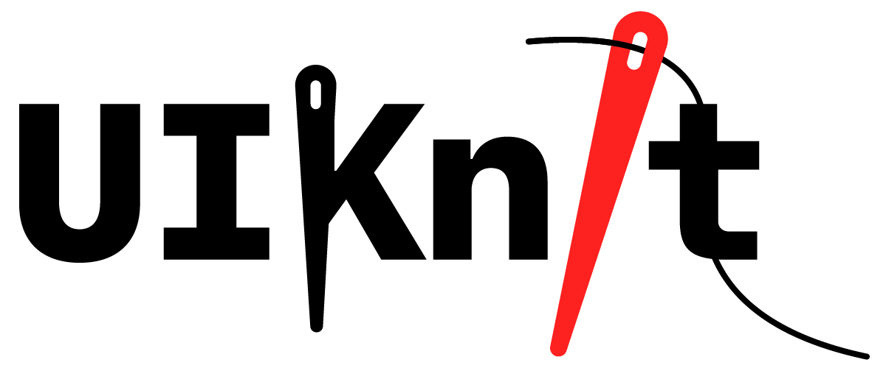

<p align="center">

</p>

<p align="center">
    
    <a href="https://swift.org/package-manager">
        
    </a>
</p>

<!-- omit in toc -->
# BDUIKnit

BDUIKnit is a collection of SwiftUI custom reusable UI components and extensions packed in a Swift Package. The package is fully documented with some exceptions of internal objects or objects that developer will not be interacting with.

- [Goals](#goals)
- [Get Started](#get-started)
	- [Installation](#installation)
	- [Quick Introduction](#quick-introduction)
	- [BDButtonTrayView](#bdbuttontrayview)
	- [BDModalTextField](#bdmodaltextfield)
	- [BDModalTextView](#bdmodaltextview)
	- [BDPersist Property Wrapper](#bdpersist-property-wrapper)
	- [Extension](#extension)

## Goals

- To collect my personal custom reusable UI components and extensions and put them in one place.
- To create custom reusable UI components and share them.
- To learn new techniques and share what I learnt building these UI & extensions.

## Get Started

### Installation

To add BDUIKnit to your project:

- Open your project in Xcode
- Go to `File > Swift Packages > Add Package Dependency...`
- Search for BDUIKnit and follow Xcode's installation dialog.

### Quick Introduction

BDUIKnit follows **MVVM** design pattern; therefore, most **Views** will have their corresponding **View Models**. View models are either `class` or `struct`, so use the appropriate `@ObservedObject`, `@State`, or `@Binding` as needed.

New to **MVVM**? Fear not. Try to read the below codes, if you can guess what they are doing, you are ready to use BDUIKnit.

``` Swift
// create a view model that controls the tray view
let trayViewModel = BDButtonTrayViewModel()
trayViewModel.mainItem = createTrayMainItem()
trayViewModel.items = createTrayItems()

trayViewModel.expanded = true
trayViewModel.shouldDisableMainItemWhenExpanded = true

trayViewModel.trayColor = Color(.systemBackground)
trayViewModel.itemActiveColor = Color.accentColor

// pass the view model to the tray view to render
BDButtonTrayView(viewModel: trayViewModel)

// while the tray view is displaying, update the view model
trayViewModel.expanded = false

// the tray view is now collapsed
```

### BDButtonTrayView

A tray-like view that is normally pinned to the bottom-trailing of a scene.

Tray item now supports more animations.

<p align="center">Regular Vertical Size Class</p>

![BDButtonTrayPreview-1][button-tray-preview]

<p align="center">Compact Vertical Size Class</p>

![BDButtonTrayPreview-2][button-tray-preview-horizontal]

<p align="center">Tray Item Animations</p>

<p align="center">

</p>

**Quick Start:**

- [`BDButtonTrayView`][BDButtonTrayView.swift]
- [`BDButtonTrayViewModel`][BDButtonTrayViewModel.swift]
- [`BDButtonTrayItem`][ButtonTrayItem.swift]

For sample code, see [`ButtonTrayViewPreview`][ButtonTrayViewPreview.swift]

### BDModalTextField

A text field view intended to be used as a modal presentation sheet when need to get inputs from user.

![BDModalTextFieldPreview][modal-text-field-preview]

**Quick Start:**

- [`BDModalTextField`][BDModalTextField.swift]
- [`BDModalTextFieldModel`][BDModalTextFieldModel.swift]

For sample code, see [`ModalTextFieldPreview`][ModalTextFieldPreview.swift]

### BDModalTextView

A text view intended to be used as a modal presentation sheet when need to get inputs from user.

![BDModalTextViewPreview][modal-text-view-preview]

**Quick Start:**

- [`BDModalTextView`][BDModalTextView.swift]
- [`BDModalTextViewModel`][BDModalTextViewModel.swift]

For sample code, see [`ModalTextViewPreview`][ModalTextViewPreview.swift]

### BDPersist Property Wrapper

A property wrapper that stores value in a given store. For example, `UserDefaults`.

**Quick Start:**

- [`BDPersist`][BDPersist.swift]
- [`BDPersistKey`][BDPersistKey.swift]
- [`BDSystemPersistentStore`][BDPersistentStore.swift]

``` Swift
// Store username in UserDefaults

@BDPersist(in: .userDefaults, key: "username", default: "")
var username: String
```

``` Swift
// Add post notification when username changed

static let nUsernameDidChange = Notification.Name("nUsernameDidChange")

@BDPersist(in: .userDefaults, key: "username", default: "", post: nUsernameDidChange)
var username: String
```

``` Swift
// Use optional value and NSUbiquitousKeyValueStore (see docs how to enable)

@BDPersist(in: .ubiquitousStore, key: "highScore", default: nil)
var highScore: Int?
```

``` Swift
// Use type-safe key

// create an enum
// conform to BDPersistKey
// implement the required prefix property
enum Keys: BDPersistKey {
	var prefix: String { "some.prefix." }
	case autoplay
	case autosave
}

// the key is 'some.prefix.autoplay'
@BDPersist(in: .userDefaults, key: Keys.autoplay, default: true)
var autoplay: Bool

// the key is 'some.prefix.autosave'
@BDPersist(in: .userDefaults, key: Keys.autosave, default: false)
var autosave: Bool
```

For sample code, see [`PersistPropertyWrapperPreview`][PersistPropertyWrapperPreview.swift]

### Extension

``` Swift
// Create Color from hex

Color(hex: "BDA12A") // a Color

UIColor(hex: "#bda12a") // a UIColor

UIColor(hex: "purple") // fatal error: create color with invalid hex: 'purple'
```

<!-- BDUIKnit File Link -->

[BDButtonTrayViewModel.swift]: https://github.com/iDara09/BDUIKnit/blob/master/Sources/BDUIKnit/ButtonTray/BDButtonTrayViewModel.swift

[ButtonTrayItem.swift]: https://github.com/iDara09/BDUIKnit/blob/master/Sources/BDUIKnit/ButtonTray/ButtonTrayItem.swift

[BDButtonTrayView.swift]: https://github.com/iDara09/BDUIKnit/blob/master/Sources/BDUIKnit/ButtonTray/BDButtonTrayView.swift

[BDModalTextFieldModel.swift]: https://github.com/iDara09/BDUIKnit/blob/master/Sources/BDUIKnit/ModalTextField/BDModalTextFieldModel.swift

[BDModalTextField.swift]: https://github.com/iDara09/BDUIKnit/blob/master/Sources/BDUIKnit/ModalTextField/BDModalTextField.swift

[BDModalTextViewModel.swift]: https://github.com/iDara09/BDUIKnit/blob/master/Sources/BDUIKnit/ModalTextView/BDModalTextViewModel.swift

[BDModalTextView.swift]: https://github.com/iDara09/BDUIKnit/blob/master/Sources/BDUIKnit/ModalTextView/BDModalTextView.swift

[BDPersist.swift]: https://github.com/iDara09/BDUIKnit/blob/master/Sources/BDUIKnit/Persist/BDPersist.swift

[BDPersistKey.swift]: https://github.com/iDara09/BDUIKnit/blob/master/Sources/BDUIKnit/Persist/BDPersistKey.swift

[BDPersistentStore.swift]: https://github.com/iDara09/BDUIKnit/blob/master/Sources/BDUIKnit/Persist/BDPersistentStore.swift

<!-- Preview File Link -->

[ButtonTrayViewPreview.swift]: https://github.com/iDara09/BDProjects/blob/master/BDProjects/BDUIKnit%20Preview/ButtonTrayViewPreview.swift

[ModalTextFieldPreview.swift]: https://github.com/iDara09/BDProjects/blob/master/BDProjects/BDUIKnit%20Preview/ModalTextFieldPreview.swift

[ModalTextViewPreview.swift]: https://github.com/iDara09/BDProjects/blob/master/BDProjects/BDUIKnit%20Preview/ModalTextViewPreview.swift

[PersistPropertyWrapperPreview.swift]: https://github.com/iDara09/BDProjects/blob/master/BDProjects/BDUIKnit%20Preview/PersistPropertyWrapperPreview.swift

<!-- Preview Image Link -->

[button-tray-preview]: https://user-images.githubusercontent.com/21166606/80023203-090a8f00-8492-11ea-9f5d-e625d6bd6202.png

[button-tray-preview-horizontal]: https://user-images.githubusercontent.com/21166606/80023242-16277e00-8492-11ea-94bc-186b11a58544.png

[modal-text-field-preview]: https://user-images.githubusercontent.com/21166606/79085645-37e47080-7cee-11ea-9d90-b73510e4506d.png

[modal-text-view-preview]: https://user-images.githubusercontent.com/21166606/80023271-217aa980-8492-11ea-8e52-23db8513654e.png
